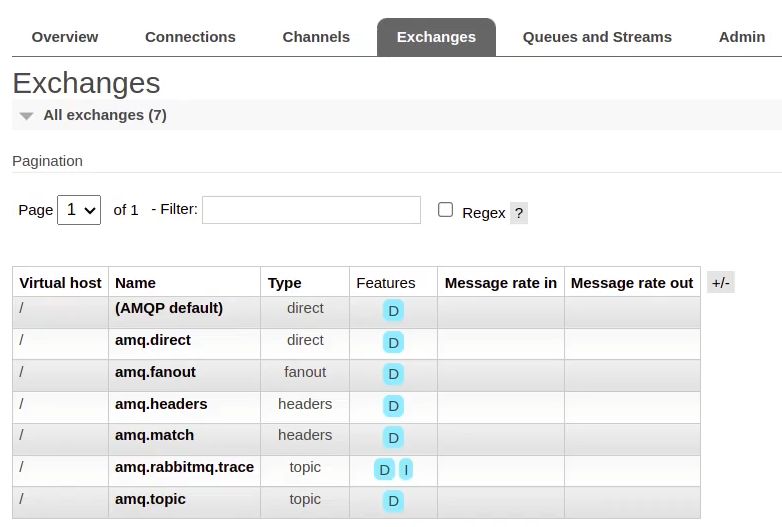
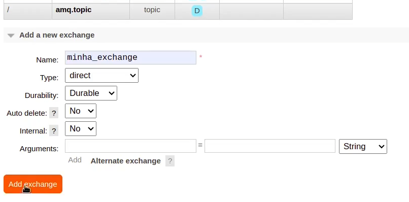
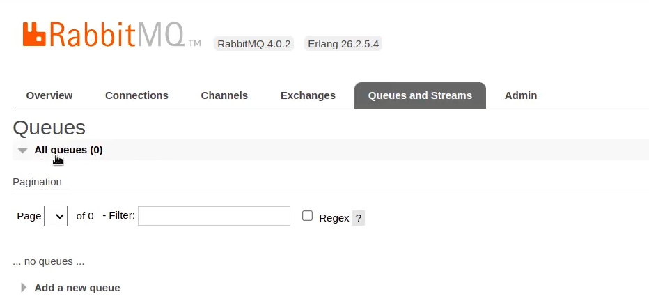
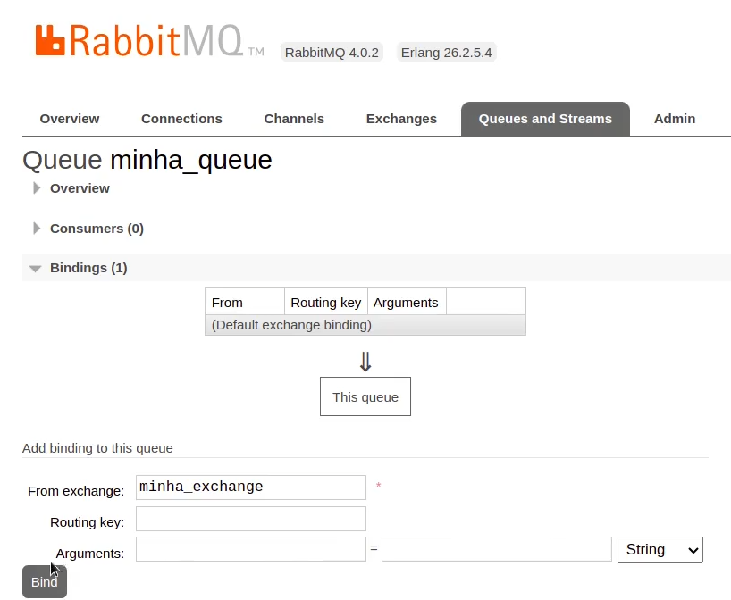
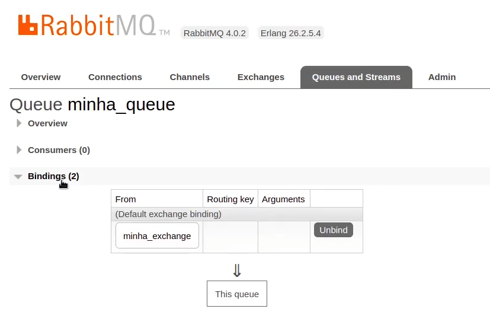

# RabbitMQ com Python

## Finalidade

RabbitMQ é um sistema de mensageria (message broker) de código aberto, amplamente utilizado para enviar, receber e rotear mensagens entre diferentes aplicações de forma assíncrona entre sistemas distribuídos.

## Modo Operacional

Seu principal objetivo é garantir o envio confiável de mensagens entre produtores e consumidores, mesmo que esses componentes não estejam disponíveis ao mesmo tempo.

## Cenário

É ideal para cenários onde a comunicação precisa ser resiliente e tolerante a falhas, como em filas de mensagens.

## Documentação

- [Portal](https://www.rabbitmq.com/)
- [Documentação para Python](https://www.rabbitmq.com/tutorials/tutorial-one-python)

## Como funciona


## Instalação

Instale usando o Docker, mas tem opção de instalação para Linux, Windows e demais.

https://www.rabbitmq.com/docs/download

```bash
docker run -it --rm --name rabbitmq -p 5672:5672 -p 15672:15672 rabbitmq:4-management
```

## Por dentro da plataforma

Após instalado acesse http://localhost:15672/ e irá aparecer a tela de login.

Caso seja o primeiro acesso, o login será o padrão: `username` guest e `password` guest.


Essa é a tela de início da aplicação:


## `Exchanges`

Algumas `Exchanges` já vem por padrão:



Para cadatrar uma nova `Exchanges`:



- `Name`:
- `Type`:
    - `direct`:
    - `fanout`:
    - `headers`:
    - `topic`:
    - `x-local-random`:
- `Durability`:

Para ver os detalhes de uma `Exchanges` é só clicar nela na tela de listagens.

## `Filas`



Para cadatrar uma nova `Fila`:


- `Virtual host`:
- `Type`:
- `Name`:
- `Durability`:
- `Arguments`:

## Relacionando (`Binding`) a `Exchange` com a `Fila`

Acesse o painel e clique me listagem das `Filas` (`Queues and Streams`)

Depois clique na fila que deseja relacionar:


Na nova tela selecione `Bindings` e preencha com as informações da `Exchange` quer quer relacionar e clique em `Bind`:



Após clicar em `Bind` o relacionamento vai estar indicado conforme imagem abaixo:



## Routing Key

Serve para direcionar as mensagens publicadas em um `exchange` (intercambiador) para as `filas` corretas.

Quando um `produtor` envia uma mensagem para o RabbitMQ, ele `não manda diretamente para uma fila`, mas sim para um `exchange`.
O `exchange` decide `para qual fila` (ou filas) essa mensagem vai, e usa o `routing key` para tomar essa decisão.

Apenas se a `Exchange` for do tipo `direct`. Você define a `Routing Key` ao configurar o `Binding` da `Fila`.

Dê um nome para o `Routing Key` e clique em `Bind`.


