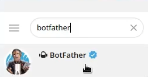
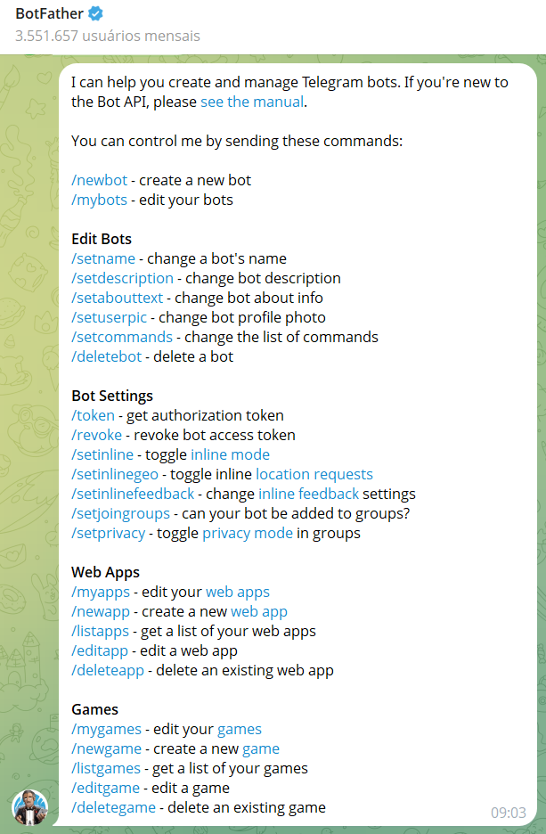
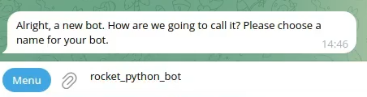
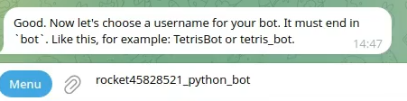
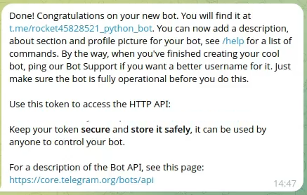

# Criando Bot no Telegram

Dentro do Telegram procure por `BotFather`:

Para Iniciar o `BotFather` digite o comando `/start`. Irá mostrar os comandos que o `BotFather` permite:

Agora na conversa digite o comando `/newbot`:

Irá pedir um nome para o Bot. Coloque o nome desejado (um nome amigável - pode conter espaço em branco entre as palavras. Ex: "meu bot de estudo") e dê enter.

Logo após irá pedir um username para o Bot (Não pode conter espaços entre as as palavras e precisa `obrigatoriamente` finalizar com `bot`. Ex: `TetrisBot` ou `tetris_bot`).

Após isso irá apresentar a mensagem do Bot criado.

